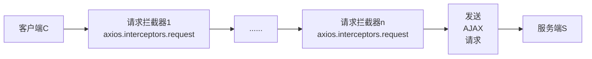
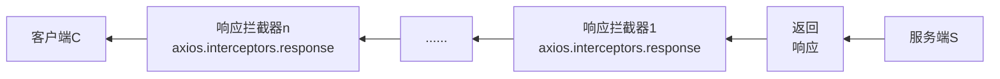
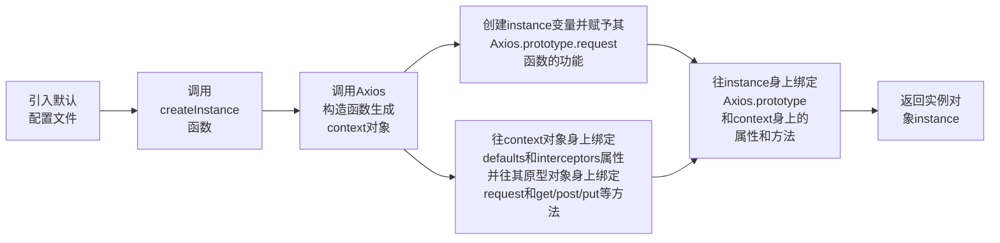
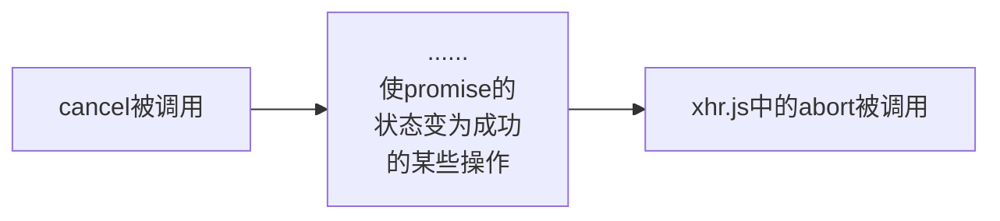
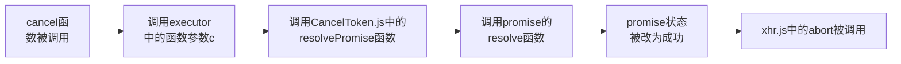

[TOC]

# axios学习笔记

## 一、前期准备

### 1、前置知识

- Promise

> 参考：[Promise学习笔记（万字长文）【手写Promise；异步编程；Promise的API；异常穿透；链式调用；async和await】_赖念安的博客-CSDN博客](https://blog.csdn.net/qq_44879358/article/details/119881376)

- AJAX

> 参考：[AJAX学习笔记（原生AJAX；jQuery；axios；fetch；跨域；JSONP；CORS）_赖念安的博客-CSDN博客](https://blog.csdn.net/qq_44879358/article/details/119839406)

### 2、配置 json-server

`json-server` 是用于快速搭建一个HTTP服务。在后续的 `axios` 学习中，`json-server` 就充当服务器的角色为我们提供HTTP服务，返回一些数据等。你也可以使用其他拥有同样功能的模块（比如：Express）。

> json-server的GitHub官网：
>
> [typicode/json-server: Get a full fake REST API with zero coding in less than 30 seconds (seriously)](https://github.com/typicode/json-server/)
>
> 官方描述：
>
> > Get a full fake REST API with zero coding in less than 30 seconds (seriously)
> >
> > 即：在不到 30 秒的时间内获得零编码的完整假 REST API（认真脸.jpg）

#### 2.1、安装 json-server

```javascript
npm install -g json-server
```

#### 2.2、创建 db.json 文件并往其中放入以下格式的内容

```javascript
{
  "posts": [
    { "id": 1, "title": "json-server", "author": "typicode" }
  ],
  "comments": [
    { "id": 1, "body": "some comment", "postId": 1 }
  ],
  "profile": { "name": "typicode" }
}
```

#### 2.3、开启 json-server 服务

==注意一定要在 `db.json` 所在的文件目录下执行下面的命令==。

```javascript
json-server --watch db.json
```

将出现三个访问资源的地址，在浏览器中输入相应地址后回车即可获取 `json-server` 给我们返回的数据（也就是上面配置在 `db.json` 中的数据，可以在地址后跟上不同的 `id` 值以获取相应的资源）。

```javascript
\{^_^}/ hi!

  Loading db.json
  Oops, db.json doesn't seem to exist
  Creating db.json with some default data

  Done

  Resources
  http://localhost:3000/posts
  http://localhost:3000/comments
  http://localhost:3000/profile

  Home
  http://localhost:3000
```

相关的路由规则（Plural routes、Singular routes、Filter等等）可以到上面提到的GitHub地址的文档说明中查看。

#### 2.4、让 json-server 延时响应

可以在启动服务时通过配置以下参数来让 `json-server` 延迟一定时间（delaytime，单位：毫秒）来给我们发送一个响应：

```javascript
// Add delay to responses (ms)
json-server --watch db.json --delay delaytime
// 或 json-server --watch db.json --d delaytime
```

比如 `json-server --watch db.json --d 2000` 就是设置服务器两秒之后再向客户端发送响应。

这在之后讨论取消请求时会用得到。

### 3、安装或引入 axios

`axios` 的相关特性描述，可到其GitHub官网或我此前写的相关博客中查看：

> axios 的 GitHub官网：[axios/axios: Promise based HTTP client for the browser and node.js](https://github.com/axios/axios)
>
> 我的相关博客：[AJAX学习笔记（原生AJAX；jQuery；axios；fetch；跨域；JSONP；CORS）_赖念安的博客-CSDN博客-四、axios发送AJAX请求-1、什么是axios及其安装或引入](https://blog.csdn.net/qq_44879358/article/details/119839406)

安装或引入axios：

在Node.js环境下：

```javascript
// 或使用 npm
npm install axios
// 或使用 yarn
yarn add axios
```

或在浏览器环境中使用script标签引入：

```javascript
<script src="https://cdn.bootcdn.net/ajax/libs/axios/0.21.1/axios.js"></script>
```

## 二、axios 的使用

有关 `axios` 的使用也可以参考我此前所写博客中的相关内容：

> 参考：[AJAX学习笔记（原生AJAX；jQuery；axios；fetch；跨域；JSONP；CORS）_赖念安的博客-CSDN博客-四、axios发送AJAX请求-2、axios的使用](https://blog.csdn.net/qq_44879358/article/details/119839406)

### 1、使用 axios() 函数的方式（通用方法）发送AJAX请求并进行数据的增删改查

基本框架：给 `axios()` 函数传入一个配置对象，该对象中包含 `method`、`url`、`data` 等配置项，具体配置规则可以参考其GitHub官网的文档描述。

`axios` 是基于Promise的， `axios()` 函数的返回值就是一个Promise类型的对象，所以可以直接在 `axios()` 函数后跟上 `then()` 函数来处理请求结果。 

```javascript
axios({
  // 这个对象内可以根据自己的需要配置相关的配置项
  // 设置请求类型
  method: 'XXXX',
  // 设置请求的目标URL（这里要结合此前安装的json-server的路由规则进行配置）
  url: 'http://localhost:3000/posts/2',
}).then(response => {
  console.log(response);
}, reason => {
  console.warn(reason);
});
```

操作演示：

```javascript
// 发送 AJAX 请求
// 查——获取 db.json 中id为2的文章内容
axios({
  // 请求类型
  method: 'GET',
  // URL
  url: 'http://localhost:3000/posts/2',
}).then(response => {
  console.log(response);
});

// 增——向 db.json 中添加data中的文章内容
axios({
  // 请求类型
  method: 'POST',
  // URL
  url: 'http://localhost:3000/posts',
  // 设置请求体，也就是我们要向服务端中要添加的数据
  data: {
    title: "今天天气不错, 还挺风和日丽的",
    author: "张三"
  }
}).then(response => {
  console.log(response);
});

// 改——修改 db.json 中id为3的文章内容
axios({
  // 请求类型
  method: 'PUT',
  // URL
  url: 'http://localhost:3000/posts/3',
  // 设置请求体，该数据将替换服务端中的指定内容
  data: {
    title: "今天天气不错, 还挺风和日丽的",
    author: "李四"
  }
}).then(response => {
  console.log(response);
});

// 删——删除 db.json 中id为3的文章内容
axios({
  // 请求类型
  method: 'delete',
  // URL
  url: 'http://localhost:3000/posts/3',
}).then(response => {
  console.log(response);
});
```

### 2、使用 axios.xxx() 的方式发送AJAX请求并进行数据的增删改查

GitHub官网中提到了以下几个API（这块涉及的API很多，建议直接查阅GitHub官方文档说明）：

```javascript
axios.request(config)
axios.get(url[, config])
axios.delete(url[, config])
axios.head(url[, config])
axios.options(url[, config])
axios.post(url[, data[, config]])
axios.put(url[, data[, config]])
axios.patch(url[, data[, config]])
```

其中，`config` 是一个配置对象，该对象中包含 `method`、`url`、`data` 等配置项，具体配置规则可以参考其GitHub官网的文档描述。`url` 是请求的目标地址（请求行）。`data` 是我们要向目标 `url` 所指定的服务端目录中添加或替换的数据（请求体）。

```javascript
//发送 GET 请求
axios.request({
  // 设置请求方法（请求行信息）
  method:'GET',
  // 设置请求的目标url（请求行信息）
  url: 'http://localhost:3000/comments'
}).then(response => {
  console.log(response);
})

//发送 POST 请求
axios.post(
  // 设置请求的目标url（请求行信息）
  'http://localhost:3000/comments',
  // 要带给服务端的数据
  {
    "body": "喜大普奔",
    "postId": 2
  }).then(response => {
  console.log(response);
})

......
```

### 3、axios 发送请求后的响应结果

`axios` 发送请求后的响应结果（也就是上面 `then()` 中的 `response` ）的结构如下：

```javascript
// {data: Array(1), status: 200, statusText: "OK", headers: {…}, config: {…}, …}
data: [{…}]
status: 200
statusText: "OK"
headers: {cache-control: "no-cache", 
          content-length: "68", 
          content-type: "application/json; charset=utf-8", 
          expires: "-1", pragma: "no-cache"}
config: {url: "http://localhost:3000/comments", 
  			method: "get", 
    		headers: {…},
        data: undefined,
      	transformRequest: Array(1), 
        transformResponse: Array(1), …}
request: XMLHttpRequest {
  			readyState: 4, 
        timeout: 0, 
        withCredentials: false, 
        upload: XMLHttpRequestUpload, 
        onreadystatechange: ƒ, …}
```

可以看到，`response` 是一个对象，其中有下面几个属性：

1. `data` 是服务端返回的具体，也就是响应体。它是一个数组，里面根据客户端发送的请求会保存若干个对象，本来应该是json格式的字符串，但是 `axios` 自动将其转换为了相应的对象类型以便我们处理数据。
2. `status` 是相应状态码，而 `statusText` 是对应的响应状态字符串。
3. `headers` 是响应头。
4. `config` 是我们所发送的请求的相关配置，包括请求行、请求头和请求体等信息。
5. `request` 是 `axios` 根据我们所发送的请求所生成的 `XMLHttpRequest` 实例对象（其实`axios` 底层也是对原生 `XMLHttpRequest` 的封装）。

### 4、config 配置对象中的配置项

上面我们提到了 `config` 这个参数。`config` 是一个配置对象，该对象中包含许多配置项，我们可以通过设置这些配置项的值来发送我们想要的请求。这个对象中可供我们设置的配置项有30个左右。我们目前只需了解其中常用的一部分（重点掌握下方高亮部分的设置项），其他的配置项可到下方的GitHub官方文档中的【Request Config】部分查阅：

> 参考：[axios/axios: Promise based HTTP client for the browser and node.js#Request Config](https://github.com/axios/axios#request-config)

1. `url`：【字符串】==设置我们想要请求的目标资源的地址==。
2. `method`：【字符串】==设置请求方法，默认为 `GET`==。
3. `baseURL`：【字符串】==设置资源的基础路径，一般和上面的 `url` 配合使用==。比如我们想要向 `'http://localhost:3000/comments'` 这个地址发送请求，那么我们可以事先设置 `baseURL` 为 `'http://localhost:3000'` ，然后发送请求时设置 `url` 为 `/comments`。这样就可以方便地使用相对路径进行资源的获取。
4. `headers`：【对象】==设置请求头信息==。
5. `data`：【对象/字符串】==设置请求体==。也就是我们想向服务端发送的数据。如果是对象类型，那么发送请求时，`axios` 会将该对象转换为JSON格式的字符串再发送（比如我们设置 `data: {firstName: 'Fred'}`，那么发送时该对象将被转换为 `'{"firstName":"Fred"}'` ；如果是字符串类型（比如我们设置 `data: 'Country=Brasil&City=Belo Horizonte'`），那么将直接发送。
6. `params`：【对象】==设置跟在 `url` 后的参数==（我理解为在向服务端发送请求时，通过查询字符串的方式所携带的那个参数）。比如我们设置 `params: {a:100,b:200}`，那么发送请求时，`axios` 将自动在 `url` 参数后面添加 `?a=100&b=200`。
7. `timeout`：【整数（单位：毫秒）】==设置超时时间==。如果超过这个时间还未收到响应，则取消这个请求。默认为 `0`，即不考虑超时。
8. `responseType`：【字符串】设置相应体的格式。默认为 `json`，即默认将收到的响应体内容转换为JSON格式，然后客户端将自动对该结果进行转换。可选项有：'arraybuffer', 'document', 'json', 'text', 'stream'。
9. `responseEncoding`：设置响应体的编码格式。默认为 `utf8`。
10. `withCredentials`：【布尔值】在跨域请求时设置是否携带 `cookie` 信息。`true` 表示携带，默认为 `false`，即不携带。
11. `maxContentLength` 和 `maxBodyLength`：【整数（单位：字节）】`maxContentLength` 用于设置HTTP响应体的最大尺寸；`maxBodyLength` 用于设置HTTP请求体的最大尺寸。注意，这两项配置只能在Node.js环境下使用。
12. `proxy`：【对象】设置代理。一般用于服务端（Node.js）。
13. `cancelToken`：==指定某个 `cancel token` 用于取消某个请求==。
14. `adapter`：【函数】用于指定发送请求时的适配器（`xhrAdapter` 或 `httpAdapter`）。
15. `decompress`：【布尔值】设置是否对响应结果进行解压。默认为 `true`。注意，该配置只能在Node.js环境下使用。
16. `xsrfCookieName` 和 `xsrfHeaderName`：【字符串】一种安全设置，保证请求是来自我们自己的客户端。需要和服务器的相关设置配合。可以有效避免跨站攻击。
17. `validateStatus`：【函数】设置判断当前请求的响应是否有效的规则。传入响应状态码 `status` 作为参数，返回一个布尔值。默认规则为：`return status >= 200 && status < 300;`。
18. `transformRequest`：【数组】允许我们将请求的数据进行一番处理，再将处理后的结果发送给服务端。它是一个数组，数组中的元素是函数类型的。我们可以将请求的数据 `data` 和请求头 `headers` 作为参数传入并最后返回一个处理过的 `data`。
19. `transformResponse`：【数组】允许我们将来自服务端的响应数据进行一番处理，再将处理后的结果传递给后续的 `then()` 或 `catch()` 函数。它也是一个数组，数组中的元素也是函数类型的。我们可以将得到的响应数据 `data` 作为参数传入并最后返回一个处理过的 `data`。
20. `onUploadProgress` 和 `onDownloadProgress`：【函数】分别设置上传和下载时的回调。

### 5、axios.defaults.xxx 设置 axios 默认配置

我们可以通过 `axios.defaults.xxx` 的方式设置一些可能会重复用到的配置项来让某个配置项拥有某个默认值，这样在后续使用该配置项时就可以省去设置的操作。

其中，`xxx` 可以是 上面提到的 `config` 中的任意一个配置项。

```javascript
axios.defaults.method = 'GET';	// 设置默认的请求类型为 GET
axios.defaults.baseURL = 'http://localhost:3000';	// 设置默认的基础 URL
axios.defaults.params = {id:100};	// 设置默认的url参数
axios.defaults.timeout = 3000;	// 设置默认的超时时间
......
```

### 6、axios.create() 创建一个新的 axios 对象

我们可以通过 `axios.create(config)` 函数创建一个拥有指定配置的新 `axios` 对象（假设对象名为 `miniAxios`），这个  `miniAxios` 的功能和原本的 axios 的功能几乎一样，==唯一不同的地方就在于这个新 axios 对象没有取消请求和批量发请求的方法==。  `miniAxios` 是函数类型的，其返回结果也是一个Promise类型的对象。我们可以像之前使用原本的 `axios` 时那样通过传入 `config` 配置对象来发送指定的AJAX请求：  `miniAxios(config)` ，也可以通过  `miniAxios.xxx()` 的方式发送请求。

```javascript
const miniAxios = axios.create({
  baseURL: 'https://api.apiopen.top',
  timeout: 2000
});

const otherAxios = axios.create({
  baseURL: 'https://www.other.com',
  timeout: 3000
});
// miniAxios 与 axios 对象的功能几乎是一样的
miniAxios({
  method: 'GET',
  url: '/getJoke',
}).then(response => {
  console.log(response);
});
// 下面这段代码和上面那段是等效的
miniAxios.get('/getJoke').then(response => {
  console.log(response.data)
})
```

当我们需要向两台不同域名的服务器发送请求时，如果用原本的 `axios` ，我们只能设置默认配置时只能针对其中一个服务器，而如果通过 `axios.create(config)` 函数创建一个拥有指定配置的新 `axios` 对象，我们就可以针对不同域名的服务器设置相应的默认配置，比如上面的 `miniAxios` 和 `otherAxios`。

### <a id="interceptors">7、axios 拦截器（Interceptors）</a>

有关拦截器的描述可到下方的GitHub官方文档中的【Interceptors】部分查阅：

> 参考：[axios/axios: Promise based HTTP client for the browser and node.js#interceptors](https://github.com/axios/axios#interceptors)

`axios` 中的的拦截器有两种：请求拦截器 `axios.interceptors.request` 和响应拦截器 `axios.interceptors.response`。

==拦截器上有个 `use()` 方法可供调用，其底层也是调用了Promise中的 `then()` 方法==，所以需要我们传入一个成功的回调和失败的回调来分别对成功和失败两种结果做出处理。

#### 7.1、请求拦截器 axios.interceptors.request



<div align="center"><font color=gray size=2>请求拦截器流程示意图</font></div>

可以看到，请求拦截器是在AJAX请求被发送之前对该请求先做层层处理后再发送给服务端。

我们通过调用 `use()` 函数的方式为请求添加一个请求拦截器：

```javascript
// 请求拦截器1
axios.interceptors.request.use(function (config) {
  // 在AJAX请求被发送之前对该请求先做某些处理
  return config;
}, function (error) {
  // 如果请求抛出错误，则会调用这个回调函数
  return Promise.reject(error);
});

// axios.interceptors.request.use(function (config) {...}	// 请求拦截器2
// ......
// axios.interceptors.request.use(function (config) {...}	// 请求拦截器n
```

我们可以通过多次像上面那样调用 `use()` 函数来为请求添加多个请求拦截器。

其中，`config` 参数就是我们想要发送的AJAX的配置对象，其中有我们上面提到的各种配置项可供我们设置。

#### 7.1、响应拦截器 axios.interceptors.response



<div align="center"><font color=gray size=2>响应拦截器流程示意图</font></div>

响应拦截器则是把从服务端返回的响应结果进行层层处理后再交给客户端。

同样的，我们也可以通过调用 `use()` 函数的方式为请求的响应添加一个响应拦截器：

```javascript
// 响应拦截器1
axios.interceptors.response.use(function (response) {
  // 当响应状态码为 2xx 时，该回调就会被执行
  // 对接收到的成功的响应做某些处理
  return response;
}, function (error) {
  // 当响应状态码不为 2xx 时，该回调就会被执行
  // 对接收到的失败的响应做某些处理
  return Promise.reject(error);
});

// axios.interceptors.response.use(function (response) {...}	// 响应拦截器2
// ......
// axios.interceptors.response.use(function (response) {...}	// 响应拦截器n
```

我们可以通过多次像上面那样调用 `use()` 函数来为请求的响应添加多个响应拦截器。

其中，`response` 参数就是我们接收到的响应对象，其中有我们上面提到的各种响应结果信息可供我们处理。

> <strong style="color:red">两种拦截器的执行流程和其中回调的执行时机的相关分析可参阅下方的【三、axios 源码分析】相关部分。</strong>

### 8、axios 取消请求（Cancellation）

有关取消请求的描述可到下方的GitHub官方文档中的【Cancellation】部分查阅：

> 参考：[axios/axios: Promise based HTTP client for the browser and node.js#cancellation](https://github.com/axios/axios#cancellation)

在通过 `axios` 发送请求时，我们可以通过此前提到的 `config` 中的 `cancelToken` 配置项与一个全局变量的配合来完成取消某个请求的操作。

```javascript
//2.声明全局变量
let cancel = null;
//发送请求
//检测上一次的请求是否已经完成
if(cancel !== null){
  //取消上一次的请求
  cancel();
}
axios({
  method: 'GET',
  url: 'http://localhost:3000/posts',
  //1. 添加配置对象的属性
  cancelToken: new axios.CancelToken(function(c){
    //3. 将 c 的值赋值给 cancel
    cancel = c;
  })
}).then(response => {
  console.log(response);
  //将 cancel 的值初始化
  cancel = null;
})
```

> <strong style="color:red">axios 取消请求时的执行流程和其中相关原理的分析可参阅下方的【三、axios 源码分析】相关部分。</strong>

## 三、axios 源码分析

### 1、源码目录结构

```
├── /dist/ 											# 项目输出目录
├── /lib/ 											# 项目源码目录
│ ├── /adapters/ 								# 定义请求的适配器 xhr、http
│ │ ├── http.js 								# 实现 http 适配器(包装 http 包)
│ │ └── xhr.js 									# 实现 xhr 适配器( 包装 xhr 对象)
│ ├── /cancel/ 									# 定义取消功能
│ ├── /core/ 										# 一些核心功能
│ │ ├── Axios.js 								# axios 的核心主类
│ │ ├── dispatchRequest.js 			# 用来调用 http 请求适配器方法发送请求的函数
│ │ ├── InterceptorManager.js 	# 拦截器的管理器
│ │ └── settle.js 							# 根据 http 响应状态，改变 Promise 的状态
│ ├── /helpers/ 								# 一些辅助方法
│ ├── axios.js 									# 对外暴露接口
│ ├── defaults.js 							# axios 的默认配置
│ └── utils.js 									# 公用工具
├── package.json 								# 项目信息
├── index.d.ts 									# 配置 TypeScript 的声明文件
└── index.js 										# 入口文件
```

<center><font color=gray size=2>以上结构整理均来自尚硅谷相关课程</font></center>

以上注释较为简洁，如果用逐一用文字描述会比较繁杂，强烈建议到下方尚硅谷的相关课程的对应部分进一步了解。

更新：2021年8月25日17:29:55

> 参考：[尚硅谷2021最新版axios入门与源码解析（P12-axios文件结构说明）\_哔哩哔哩_bilibili](https://www.bilibili.com/video/BV1wr4y1K7tq?p=12)

下面是我自己画的相关思维导图，可以结合后续内容进行对照理解（如果图片太小导致看不清，可以下载到本地查看）。


### 2、axios 创建实例过程

相关的源代码如下：

```javascript
// \node_modules\axios\lib\axios.js

......
// 导入默认配置
var defaults = require('./defaults');

/**
 * Create an instance of Axios
 * 创建一个 Axios 的实例对象
 */
function createInstance(defaultConfig) {
  // 创建一个实例对象 context，此时它身上有 get、post、put等方法可供我们调用
  var context = new Axios(defaultConfig);	// 此时，context 不能当函数使用  
  // 将 request 方法的 this 指向 context 并返回新函数，此时，instance 可以用作函数使用, 
  // 且其与 Axios.prototype.request 功能一致，且返回的是一个 promise 对象
  var instance = bind(Axios.prototype.request, context);
  // 将 Axios.prototype 和实例对象 context 的方法都添加到 instance 函数身上
  // 也就是说，我们此后可以通过 instance.get instance.post ... 的方式发送请求
  utils.extend(instance, Axios.prototype, context);
  utils.extend(instance, context);

  return instance;
}

// 通过配置创建 axios 函数，
// 下面的defaults就是上方顶部通过require('./defaults') 引入的默认配置，
// 就是此前我们提到的，可以通过 axios.defaults.xxx 的方式设置的默认配置
var axios = createInstance(defaults);
```

可以看到 `axios` 实例对象由 `\node_modules\axios\lib\axios.js` 中的 `createInstance()` 函数创建。

其中传入的 `defaults` 参数就是代码上方通过 `require('./defaults')` 引入的默认配置，也就是此前我们提到的，可以通过 `axios.defaults.xxx` 的方式设置的那个默认配置。

#### 2.1、context 变量（Axios实例对象）

在 `createInstance()` 函数内部返回 `axios` 实例对象之前，还通过调用 `\node_modules\axios\lib\core\Axios.js` 中的 `Axios(){...}` 构造函数创建了一个 `context` 变量。仔细观察下方的 `Axios` 构造函数文件，可以发现：

-  `context` 变量身上有 `defaults` 和 `interceptors` 这两个属性。

- 而且通过 `utils.forEach()` 函数，`context` 变量身上被绑定了各种发送请求的方法（get、post、put等），而且==这些方法内部其实都是调用了 `Axios.prototype.request` 这个方法来实现发送请求的功能的==。所以理解好这个 `request` 函数是比较关键的。

```javascript
// \node_modules\axios\lib\core\Axios.js

// Axios 构造函数文件

// 引入工具
var InterceptorManager = require('./InterceptorManager');
// 引入发送请求的函数
var dispatchRequest = require('./dispatchRequest');
......

/**
 * 创建 Axios 构造函数
 */
function Axios(instanceConfig) {
  // 实例对象上的 defaults 属性为配置对象
  this.defaults = instanceConfig;
  // 实例对象上有 interceptors 属性，用来设置请求和响应拦截器
  this.interceptors = {
    request: new InterceptorManager(),
    response: new InterceptorManager()
  };
}

/**
 * 发送请求的方法.  原型上配置, 则实例对象就可以调用 request 方法发送请求
 */
Axios.prototype.request = function request(config) {
  ......
  var promise = Promise.resolve(config);
  ......
  return promise;
}

// 在通过 Axios() 构造函数创建出来的实例对象上添加 get、post、put等方法
// 发送请求时不携带数据的方法
utils.forEach(['delete', 'get', 'head', 'options'], function (method) {...}
// 发送请求时携带数据的方法
utils.forEach(['post', 'put', 'patch'], function (method) {...}
```

#### 2.2、instance 变量（我们所使用的 axios 实例对象）

##### 2.2.1、创建 instance 变量，并将它赋值为一个函数

```javascript
// 将 request 方法的 this 指向 context 并返回新函数，此时，instance 可以用作函数使用, 
// 且其与 Axios.prototype.request 功能一致，且返回的是一个 promise 对象
var instance = bind(Axios.prototype.request, context);
```

 `context` 变量被创建出来后，而且通过 `bind()` 方法将 `Axios.prototype.request` 方法的 `this` 指向 `context` 并返回新函数，同时还创建了一个新的变量 `instance` 来接收这个返回的函数。此时，`instance` 可以用作函数使用, 且其与 `Axios.prototype.request` 功能一致，且返回的是一个Promise类型的对象（==这也是为什么我们可以通过`axios({...}).then()` 的方式发送请求，并可以像处理Promise对象一样对请求的响应结果做处理==）

> 其中，`bind()` 这个方法来自 `\node_modules\axios\lib\helpers\bind.js`。其作用和原生JavaScript中的 `Function.prototype.bind()` 函数一致，只不过 `bind.js` 中对它做了一个封装。
>
> 详情可参阅相关MDN文档：[Function.prototype.bind() - JavaScript | MDN](https://developer.mozilla.org/zh-CN/docs/Web/JavaScript/Reference/Global_Objects/Function/bind)

##### 2.2.2、往 instance 变量上添加各种 Axios.prototype 和 context 身上的方法

```javascript
// 将 Axios.prototype 和实例对象 context 的方法都添加到 instance 函数身上
// 也就是说，我们此后可以通过 instance.get instance.post ... 的方式发送请求
utils.extend(instance, Axios.prototype, context);
utils.extend(instance, context);
```

随后，我们又通过 `utils.extend()` 方法往 `instance` 变量上添加各种 `Axios.prototype` 和 `context` 身上的属性（`defaults`、`interceptors`）和方法（`get`、`post`、`put`等）（==这也是为什么我们可以通过`axios.xxx({...}).then()` 的方式发送请求，并可以像处理Promise对象一样对请求的响应结果做处理==）。

> `extend()` 这个方法来自 `\node_modules\axios\lib\utils.js`。其作用其实就是遍历 `Axios.prototype` 或 `context` 身上的属性或方法，并将其绑定到 `instance` 身上。其中第三个参数是用于指定 `this` 的指向。

做完上面几件事，`createInstance()` 函数就将 `instance` 作为返回值返回，并且赋值给一个变量 `axios` ，也就是我们使用 `axios({...})` 和 `axios.xxx({...})` 时的那个 `axios`。

至此，`axios` 创建实例的过程就基本捋清了。



#### 2.3、axios.create() 工厂函数

在我们通过 `createInstance()` 函数返回了一个 `axios` 实例对象之后，源码中还往这个实例对象身上添加了一个函数：`create()`。这是一个工厂函数，用来创建一个新的 `axios` 实例对象。

```javascript
// 工厂函数  用来返回创建实例对象的函数
axios.create = function create(instanceConfig) {
  return createInstance(mergeConfig(axios.defaults, instanceConfig));
};
```

其内部也是调用了 `createInstance()` 函数。它支持我们传入一个配置对象，源码中先是通过 `mergeConfig()` 函数合并了默认配置 `defaults` 和我们传入的实例对象的自定义配置 `instanceConfig`，然后再将合并后的配置作为 `createInstance()` 函数的参数，最后返回一个新的 `axios` 实例对象。

#### 2.4、区分上面提到的几个变量

> 以下关系总结主体来自尚硅谷相关课程的课件，我只做了一些格式调整和部分补充。

##### 2.4.1、axios 和 Axios 的关系

其实就是区别 `axios` 和上文提到的 `context` 。

1. 从语法上来说: `axios` 不是 `Axios` 的实例（上文提到的 `context` 才是）
2. 从功能上来说: `axios` 是 `Axios` 的实例（主要是上方提到的 `bind()` 和 `extend()` 函数的功劳）
   3. `axios` 是 `Axios.prototype.request` 函数 `bind()` 返回的函数
   2. `axios` 作为对象，有 `Axios` 原型对象上的所有方法，有 `Axios` 对象上所有属性

##### 2.4.2、instance 与 axios 的区别

1. 相同:
(1) 都是一个能发任意请求的函数: `request(config)`
(2) 都有发特定请求的各种方法: `get()/post()/put()/delete()`
(3) 都有默认配置和拦截器的属性: `defaults/interceptors`
2. 不同:
    (1) 默认配置很可能不一样
    (2) `instance` 没有 `axios` 后面添加的一些方法: `create()/CancelToken()/all()`

我觉得可以这样认为：`axios` 可以看做是 `instance` 的超集。主要是因为 `axios` 被创建出来之后，源码中还在其身上添加了诸如 `create()`、`all()` 、`CancelToken()`、`spread()`这些方法和 `Axios` 属性。

### 3、axios 发送请求过程

其实这块就是==重点关注 `\node_modules\axios\lib\core\Axios.js` 文件中的 `Axios.prototype.request` 这个函数==，因为其他所有发送请求的方法（比如 `get()/post()/put()/delete()` 等）都是在内部调用了这个方法来完成发送请求的功能。

```javascript
// \node_modules\axios\lib\core\Axios.js

// 这个函数是用于发送请求的中间函数，真正发送AJAX请求的操作是被封装在
// \node_modules\axios\lib\adapters\xhr.js 这个文件中的
Axios.prototype.request = function request(config) {
  // 下面这个 if 判断主要是允许我们通过 axios('http://www.baidu.com', {header:{}})
  // 的方式来发送请求，若传入的config是字符串格式，则将第一个参数当做url，第二个参数当做配置对象
  if (typeof config === 'string') {
    config = arguments[1] || {};
    config.url = arguments[0];
  } else {
    config = config || {};
  }
  //将默认配置与用户调用时传入的配置进行合并
  config = mergeConfig(this.defaults, config);

  // 设定请求方法
  // 如果我们传入的配置对象中指定了请求方法，则按这个指定的方法发送相应请求
  if (config.method) {
    config.method = config.method.toLowerCase();
  } else if (this.defaults.method) {
    // 如果我们没有指定请求方法，且默认配置中指定了请求方法，则按默认配置中的请求方法发送相应请求
    config.method = this.defaults.method.toLowerCase();
  } else {
    // 如果传入的自定义配置和默认配置中都没有指定，那么就默认发送 get 请求
    config.method = 'get';
  }
  
	// 创建拦截器中间件，第一个元素是一个函数，用来发送请求；第二个为 undefined（用来补位）
  var chain = [dispatchRequest, undefined];
  // 创建一个 promise 对象，且其状态一定是成功的，同时其成功的值为合并后的请求配置对象
  var promise = Promise.resolve(config);
  
  // 下面是是有关拦截器的相关设置，暂且不做讨论
  ......
  
  // 如果链条长度不为 0
  while (chain.length) {
    // 依次取出 chain 的回调函数, 并执行
    promise = promise.then(chain.shift(), chain.shift());
  }
  
  // 最后返回一个Promise类型的对象
  return promise;
};
```

#### 3.1、dispatchRequest 函数

注意到上方代码中的 `chain` 数组变量中有一个 `dispatchRequest` 数组元素：

```javascript
// 创建拦截器中间件，第一个元素是一个函数，用来发送请求；第二个为 undefined（用来补位）
var chain = [dispatchRequest, undefined];
```

这==是 `Axios.prototype.request` 函数中关键点之一==。因为 `dispatchRequest` 这个数组元素是用于发送请求的，它的类型为函数。而它是来自 `\node_modules\axios\lib\core\dispatchRequest.js` 中的函数。

```javascript
// \node_modules\axios\lib\core\dispatchRequest.js

// 使用配置好的适配器发送一个请求
module.exports = function dispatchRequest(config) {
  //如果被取消的请求被发送出去, 抛出错误
  throwIfCancellationRequested(config);

  //确保头信息存在
  config.headers = config.headers || {};

  // 对请求数据进行初始化转化
  config.data = transformData(
    ......
  );

    // 合并一切其他头信息的配置项
  config.headers = utils.merge(
    ......
  );

  // 将配置项中关于方法的配置项全部移除，因为上面已经合并了配置
  utils.forEach(
    ......
  );

  // 获取适配器对象 http  xhr
  var adapter = config.adapter || defaults.adapter;

  // 发送请求， 返回请求后 promise 对象  ajax HTTP
  return adapter(config).then(function onAdapterResolution(response) {
    // 如果 adapter 中成功发送AJAX请求，则对响应结果中的数据做一些处理并返回成功的Promise
    ......
    // 设置 promise 成功的值为 响应结果
    return response;
  }, function onAdapterRejection(reason) {
    // 如果 adapter 中发送AJAX请求失败，则对失败原因做些处理并返回失败的Promise
    ......
    // 设置 promise 为失败, 失败的值为错误信息
    return Promise.reject(reason);
  });
};
```

#### 3.2、adapter 变量（函数）

而在上面 `dispatchRequest.js` 中的 `dispatchRequest()` 函数中，有一个比较关键的 `adapter` 变量，这个变量是用来获取发送请求的适配器的，==真正发送请求的底层操作都是封装在这里的==。它也是 `config` 配置对象身上的一个配置属性。

同时也要注意， `adapter` 变量是函数类型的，而且其返回值返回值是一个Promise类型的对象。

```javascript
// 获取适配器对象 http  xhr
var adapter = config.adapter || defaults.adapter;
```

> `adapter` 一般有两类：
>
> ①发送AJAX请求的 `xhrAdapter()`。它在 `\node_modules\axios\lib\adapters\xhr.js` 文件中。
>
> ②发送HTTP请求的 `httpAdapter()`。它在 `\node_modules\axios\lib\adapters\http.js` 文件中。

#### 3.3、发送请求的大致流程

发送请求的流程大概就如下图：


### 4、axios 拦截器工作原理

其实这块也是重点关注 `\node_modules\axios\lib\core\Axios.js` 文件中的 `Axios.prototype.request` 这个函数，因为由此前【[二-7、axios 拦截器（Interceptors）](#interceptors)（按住<kbd>Ctrl</kbd>）键单击即可跳转】中所提到的拦截器工作流程可知，==无论是请求拦截器和响应拦截器，都应该在我们发送请求之前就设置好==。

首先回顾我们是如何使用拦截器的：

```javascriptcls
// 请求拦截器1
axios.interceptors.request.use(function (config) {
  return config;
}, function (error) {
  return Promise.reject(error);
});

// 响应拦截器1
axios.interceptors.response.use(function (response) {
  return response;
}, function (error) {
  return Promise.reject(error);
});
```

#### 4.1、interceptors.request 和 interceptors.response 两个属性

前面讨论 `axios` 创建实例的过程时，在 `Axios.js` 这个文件的构造函数 `Axios(){...}` 中，源码往实例对象身上添加了 `interceptors` 这个对象属性。而这个对象属性又有 `request` 和 `response` 这两个属性。

```javascript
// \node_modules\axios\lib\core\Axios.js
......

function Axios(instanceConfig) {
  this.defaults = instanceConfig;
  //实例对象上有 interceptors 属性用来设置请求和响应拦截器
  this.interceptors = {
    request: new InterceptorManager(),
    response: new InterceptorManager()
  };
}
......
```

#### 4.2、InterceptorManager 构造函数

而这两个属性都是由 `InterceptorManager()` 构造函数创建出来的实例对象。`use()` 函数则是 `InterceptorManager` 原型对象身上的一个函数属性，所以 `request` 和 `response` 这两个属性才可以调用该函数。

```javascript
// \node_modules\axios\lib\core\InterceptorManager.js
......
function InterceptorManager() {
  // 创建一个handlers属性，用于保存 use() 函数传进来的两个回调函数参数
  this.handlers = [];
}

// 添加拦截器到栈中, 以待后续执行, 返回拦截器的编号(编号为当前拦截器综合数减一)
InterceptorManager.prototype.use = function use(fulfilled, rejected) {
  this.handlers.push({
    fulfilled: fulfilled,
    rejected: rejected
  });
  return this.handlers.length - 1;
};
......
```

#### 4.3、use() 函数

而 `use()` 函数的作用就是将传入 `use()` 的两个回调函数 `fulfilled` 和 `rejected` 包装在一个对象中（==这个对象就算是一个拦截器==），再保存在 `InterceptorManager` 实例对象（也就是上面提到的 `request` 或 `response` 对象属性）身上的 `handlers` 数组上。

==每调用一次 `use()` 函数都会在相应的 `request` 或 `response` 对象属性身上压入一个包含一对回调函数的对象==。

#### 4.4、在 Axios.prototype.request 函数中遍历实例对象的拦截器并压入 chain

我们知道，给某个请求添加拦截器（无论是响应拦截器还是请求拦截器）都是在发送请求之前进行的操作。所以此时就又要回到 `\node_modules\axios\lib\core\Axios.js` 中的 `Axios.prototype.request` 函数。

```javascript
// \node_modules\axios\lib\core\Axios.js

// 这个函数是用于发送请求的中间函数，真正发送AJAX请求的操作是被封装在
// \node_modules\axios\lib\adapters\xhr.js 这个文件中的
Axios.prototype.request = function request(config) {
  if (typeof config === 'string') {
    ......
  }
  config = mergeConfig(this.defaults, config);
  if (config.method) {
    ......
  }
	
  // 创建拦截器中间件，第一个元素是一个函数，用来发送请求；第二个为 undefined（用来补位）
  var chain = [dispatchRequest, undefined];
  // 创建一个成功的 promise 且其结果值为合并后的请求配置
  var promise = Promise.resolve(config);
  // 遍历实例对象的请求拦截器
  this.interceptors.request.forEach(function unshiftRequestInterceptors(interceptor) {
    // 将请求拦截器压入数组的最前面
    chain.unshift(interceptor.fulfilled, interceptor.rejected);
  });

  // 遍历实例对象的响应拦截器
  this.interceptors.response.forEach(function pushResponseInterceptors(interceptor) {
    // 将响应拦截器压入数组的最尾部
    chain.push(interceptor.fulfilled, interceptor.rejected);
  });

  // 如果链条长度不为 0
  while (chain.length) {
    // 依次取出 chain 的回调函数, 并执行
    promise = promise.then(chain.shift(), chain.shift());
  }
  
  // 最后返回一个Promise类型的对象
  return promise;
};
  
```

可以看到，发送请求时，源码中分别对 `axios` 实例对象中 `interceptors.request` 和 `interceptors.response` 这两个属性中的 `handlers` 数组进行了遍历（利用已经封装好的 `forEach()` 函数）。

并且把 `interceptors.request` 中保存的请求拦截器回调函数==成对==地压入 `chain` 数组的==头部==（通过数组对象的 `unshift()` 方法）；把 `interceptors.response` 中保存的响应拦截器回调函数==成对==地压入 `chain` 数组的==尾部==（通过数组对象的 `push()` 方法）。

#### 4.5、大致流程图&拦截器工作先后顺序

大概流程如下图所示：


<center><font color=gray size=2>以上图示来自尚硅谷相关课程</font></center>

> 注意，对于请求拦截器：上面的【请求拦截器1】是在【请求拦截器2】之前被压入 `chain` 数组==头部==的，但是【请求拦截器2】的下标位置比较靠前，这也是为什么==【请求拦截器2】中的回调会先被执行==。
>
> 而对于响应拦截器：上面的【响应拦截器1】是在【响应拦截器2】之前被压入 `chain` 数组==尾部==的，但是【响应拦截器1】的下标位置比较靠前，这也是为什么==【响应拦截器1】中的回调会先被执行==。

观察下面代码的输出结果：

```javascript
......
// 发送请求的函数
function dispatchRequest(config){
  console.log('发送请求');
  return new Promise((resolve, reject) => {
    resolve({
      status: 200,
      statusText: 'OK'
    });
  });
}
......
// 设置两个请求拦截器
axios.interceptors.request.use(function one(config) {
  console.log('请求拦截器 成功 - 1号');
  return config;
}, function one(error) {
  console.log('请求拦截器 失败 - 1号');
  return Promise.reject(error);
});

axios.interceptors.request.use(function two(config) {
  console.log('请求拦截器 成功 - 2号');
  return config;
}, function two(error) {
  console.log('请求拦截器 失败 - 2号');
  return Promise.reject(error);
});

// 设置两个响应拦截器
axios.interceptors.response.use(function (response) {
  console.log('响应拦截器 成功 1号');
  return response;
}, function (error) {
  console.log('响应拦截器 失败 1号')
  return Promise.reject(error);
});

axios.interceptors.response.use(function (response) {
  console.log('响应拦截器 成功 2号')
  return response;
}, function (error) {
  console.log('响应拦截器 失败 2号')
  return Promise.reject(error);
});


// 发送请求
axios({
  method: 'GET',
  url: 'http://localhost:3000/posts'
}).then(response => {
  console.log(response);
});

// 输出结果
请求拦截器 成功 - 2号
请求拦截器 成功 - 1号
发送请求
响应拦截器 成功 1号
响应拦截器 成功 2号
```

#### 4.6、逐个调用 chain 中的拦截器

之后，就是通过一个 `while` 循环，对 `chain` 数组中存储的拦截器逐个调用，==其中涉及到每个拦截器工作后的 promise 对象的状态和结果值的传递==。这个过程有点像是跳板，如下图所示：


#### 4.7、有关 while 循环中代码的疑惑

注意，对于 `Axios.prototype.request` 这个函数中的下面这段代码：

```java
//如果链条长度不为 0
while (chain.length) {
  //依次取出 chain 的回调函数, 并执行，注意：shift()函数会改变原数组
  promise = promise.then(chain.shift(), chain.shift());
}
```

我一开始有个疑问：`then()` 函数中的两个回调函数参数，不应该是只会执行其中一个的吗？如果上面的那个 `promise` 是成功的，那么第二个失败的回调不就不会执行了吗？也就是上面的 `then()` 函数中的第二个 `chain.shift()` 不就不会执行了吗？那这样的话，那个 `chain` 数组中的不就还会残留一个失败的回调吗？


后来我仔细回顾了之前学习的Promise中 `then()` 函数的相关内容，还是没有解决疑惑。但是后来一想，是我自己混淆了两个概念：如果上面的那个 `promise` 是成功的，那么第二个失败的回调就不会执行==不等于== `shift()` 这个函数本身不会执行啊！

其实上面的代码可以看做是等价于下面的代码，关键在于一定要注意==shift()函数会改变原数组，且其返回值就是被弹出的那个数组元素==：

```javascript
//如果链条长度不为 0
while (chain.length) {
  // 注意：shift()函数会改变原数组，它弹出的始终是数组中的第一个元素啊
  
  // 相当于是把上面数组中的第一个元素（下标为0）弹出并保存在onResolved中了，
  // 此时下标为1的元素就变成了数组中的第一个元素
  let onResolved = chain.shift();
  
  // 相当于是把上面下标为1的元素弹出并保存在onRejected中了
  let onRejected = chain.shift();
  //依次取出 chain 的回调函数, 并执行，
  promise = promise.then(onResolved, onRejected);
}
```

### 5、axios 取消请求过程

首先回顾一下我们使用 `axios` 取消请求的过程：

```javascript
// 2.声明全局变量
let cancel = null;
// 发送请求
// 检测上一次的请求是否已经完成
if(cancel !== null){
  // 取消上一次的请求
  cancel();
}
axios({
  method: 'GET',
  url: 'http://localhost:3000/posts',
  // 1. 添加配置对象的属性
  cancelToken: new axios.CancelToken(function(c){
    // 3. 将 c 的值赋值给 cancel
    cancel = c;
  })
}).then(response => {
  console.log(response);
  //将 cancel 的值初始化
  cancel = null;
})

......
// 调用 cancelFunc() 函数以取消请求
cancel();
```

值得我们关注的有我们自定义声明的 `cancel` 这个全局变量还有 `axios` 配置对象中的 `cancelToken` 属性。

#### 5.1、取消 axios 请求的底层代码

首先，我们问自己一个问题：如果要取消一个AJAX请求，我们该怎么做？答案是：调用 `XMLHttpRequest` 对象身上的 `abort()` 方法。而在 `axios` 中，具备这部分功能的代码就被封装在 `\node_modules\axios\lib\adapters\xhr.js` 中的下面这个 `if` 判断中：

```javascript
// \node_modules\axios\lib\adapters\xhr.js
......
//如果我们发送请求时传入的配置对象中配置了 cancelToken，则调用 then 方法设置成功的回调
if (config.cancelToken) {
  config.cancelToken.promise.then(function onCanceled(cancel) {
    if (!request) {
      return;
    }
    //取消请求
    request.abort();
    reject(cancel);
    request = null;
  });
}
......
```

可以看到，源码是先判断我们有没有在发送请求时传入的配置对象中设置 `cancelToken` 属性。如果没有设置，那就说明我们没有取消请求的需求，那自然也就不需要进入判断。

如果设置了 `cancelToken` 属性，那么就调用这个 `cacelToken` 实例对象身上的 `promsise` 属性（这个属性是Promise类型的对象）的 `then()` 方法。

> 注意，上述的 `then()` 方法中，源码只配置了成功的回调，而没有配置失败的回调，那是因为只需要配置成功的回调就可以满足我们的需求。

==当上述 `cacelToken` 实例对象身上的 `promise` 属性的状态为成功时，就会触发 `abort()` 函数，从而达到取消请求的目的==。

#### 5.2、axios.CancelToken() 构造函数

经过上面的铺垫，我们就将分析的重点转移到了【==如何让 `cacelToken` 实例对象身上的 `promise` 属性的状态变为成功==】上。

再次回顾我们使用 `axios` 取消请求的过程，可以看到，我们是通过调用全局的 `cancel()` 函数来取消请求的。那么由 `cancel()` 到 `xhr.js` 中的 `abort()` 又经过了什么操作可以使得 `cacelToken` 实例对象身上的 `promise` 属性的状态变为成功的呢？



<center><font color=gray size=2>取消 axios 请求的大致抽象流程</font></center>


具体流程分析请看下图：


<center><font color=gray size=2>取消 axios 请求的流程示意图（主要关注蓝色标注部分）</font></center>

`axios.CancelToken()` 是通过引入 `\node_modules\axios\lib\cancel\CancelToken.js` 中的 `CancelToken(executor) {...}` 函数得到的。

```javascript
// \node_modules\axios\lib\axios.js
......
axios.CancelToken = require('./cancel/CancelToken');
......
```

```javascript
// \node_modules\axios\lib\cancel\CancelToken.js
......
function CancelToken(executor) {
  // 执行器函数必须是一个函数，否则会报错
  if (typeof executor !== 'function') {
    throw new TypeError('executor must be a function.');
  }

  // 声明一个变量
  var resolvePromise;
  // 实例对象身上添加 promise 属性
  this.promise = new Promise(function promiseExecutor(resolve) {
    // 将修改 promise 对象成功状态的函数暴露出去，
    // 也就是说，当resolvePromise()被调用时，相当于调用了resolve()，
    // 也就是promise状态被改为了成功
    resolvePromise = resolve;
  });
  // token 指向当前的实例对象
  var token = this;
  // 将修改 promise 状态的函数暴露出去, 通过 cancel = c 可以将函数赋值给 cancel
  executor(function cancel(message) {
    if (token.reason) {
      return;
    }

    token.reason = new Cancel(message);
    // 这里调用了resolvePromise()，根据上面的说法，
    // 此时，promise的状态被改为了成功，且其结果值为 token.reason
    resolvePromise(token.reason);
  });
}
......
```

再结合我们在 5.1 中对取消请求的底层代码的分析，此时，由于 `cacelToken` 实例对象身上的 `promise` 属性的状态被改为了成功，所以就触发了 `xhr.js` 中的 `abort()` 函数，从而 `axios` 请求被取消。

所以，此时，上方的【取消 axios 请求的大致抽象流程】就可以具体描述如下：



<center><font color=gray size=2>取消 axios 请求的具体流程</font></center>

2021年8月28日01:07:19——完

## 有关参考


> 更新：2021年8月24日15:58:50
>
> > 【前置知识】
> >
> > 参考：[AJAX学习笔记（原生AJAX；jQuery；axios；fetch；跨域；JSONP；CORS）_赖念安的博客-CSDN博客](https://blog.csdn.net/qq_44879358/article/details/119839406)
> >
> > 参考：[Promise学习笔记（万字长文）【手写Promise；异步编程；Promise的API；异常穿透；链式调用；async和await】_赖念安的博客-CSDN博客](https://blog.csdn.net/qq_44879358/article/details/119881376)
>
> 更新：2021年8月24日16:10:12
>
> > 【json-server】
> >
> > 参考：[typicode/json-server: Get a full fake REST API with zero coding in less than 30 seconds (seriously)](https://github.com/typicode/json-server/)
> >
> > 参考：[naholyr/json-server-gui: GUI for json-server](https://github.com/naholyr/json-server-gui)
>
> 更新：2021年8月24日19:05:10
>
> > 参考：[Axios在线文档](https://axios-http.com/zh/)
>
> 更新：2021年8月25日21:22:20
>
> > 【bind、apply、call】
> >
> > 参考：[Function.prototype.apply() - JavaScript | MDN](https://developer.mozilla.org/zh-CN/docs/Web/JavaScript/Reference/Global_Objects/Function/apply)
> >
> > 参考：[Function.prototype.bind() - JavaScript | MDN](https://developer.mozilla.org/zh-CN/docs/Web/JavaScript/Reference/Global_Objects/Function/bind)
> >
> > 参考：[Function.prototype.call() - JavaScript | MDN](https://developer.mozilla.org/zh-CN/docs/Web/JavaScript/Reference/Global_Objects/Function/call)